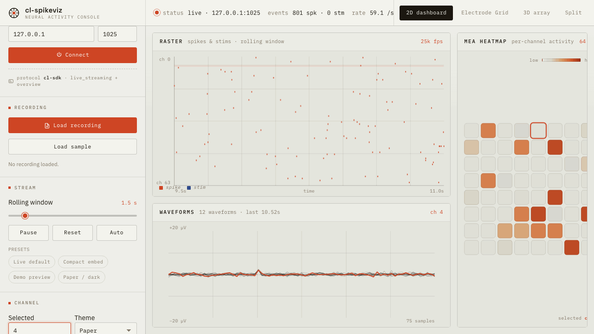
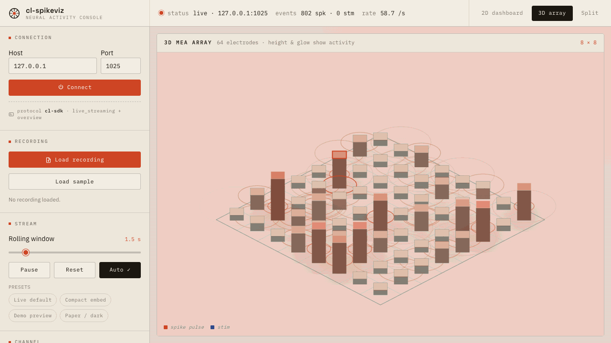
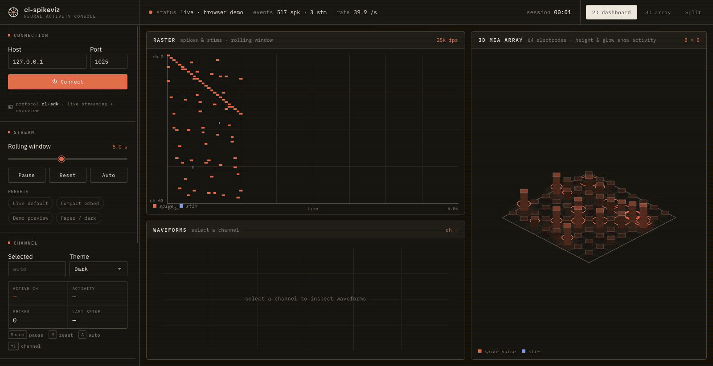

# cl-spikeviz

[Open the live demo](https://mikmikmiller.github.io/cl-spikeviz/?demo=1)

`cl-spikeviz` is a standalone browser visualizer for Cortical Labs `cl-sdk` simulator streams and replayable JSON stream snapshots.

It is intentionally small:

- static HTML/CSS/JavaScript modules
- no framework
- no build pipeline
- dependency-free 2D and isometric canvas renderers
- browser-only recording replay from compact snapshot JSON
- local static hosting and GitHub Pages friendly

This v0.1 simulator preview is for reviewing stream handling, parser assumptions, recording replay, and the browser UI around the `cl-sdk` simulator WebSocket output. It does not require CL1 hardware and does not claim support for hardware-only behavior.

## Browser Preview

The captures below are regenerated from the running app with `npm run capture:assets:live` against a local `cl-sdk` simulator. Each capture waits 10 seconds after the stream starts, then records a short rolling window so the raster, waveform, heatmap, and 3D pulses keep moving.

### Live dashboard



### 3D MEA view



### Split view



## Reviewer Path

1. Run the browser demo:

   ```bash
   npm install
   python3 -m http.server 8080
   ```

   Open `http://127.0.0.1:8080/?demo=1`.

   To review replay without a simulator, click **Load sample** or drag `assets/sample-recording.json` into the app.

2. Run checks:

   ```bash
   npm test
   npm run test:ui
   ```

3. Review protocol notes:

   - [docs/STREAM_PROTOCOL.md](docs/STREAM_PROTOCOL.md)
   - [docs/LIMITATIONS.md](docs/LIMITATIONS.md)

4. Optional live simulator check:

   ```bash
   uv venv --python 3.12 .venv
   uv pip install --python .venv/bin/python cl-sdk websockets
   .venv/bin/python tools/run_simulator.py --seconds 300
   ```

   In a second terminal:

   ```bash
   python3 -m http.server 8080
   ```

   Open `http://127.0.0.1:8080/?host=127.0.0.1&port=1025`.

## Modes

### Demo Mode

Demo mode uses deterministic browser-generated sample activity. It is useful for UI review, screenshots, and smoke testing without Python or `cl-sdk`.

```text
http://127.0.0.1:8080/?demo=1
http://127.0.0.1:8080/?demo=1&view=3d
http://127.0.0.1:8080/?demo=1&view=split&compact=1
```

### Live Simulator Mode

Live mode connects to a running `cl-sdk` simulator WebSocket server.

The app currently consumes:

- `ws://<host>:<port>/_/ws/overview`
- `ws://<host>:<port>/_/ws/live_streaming`

Public `cl-sdk` documentation describes enabling the simulator WebSocket server with `CL_SDK_WEBSOCKET=1` and configuring host/port with `CL_SDK_WEBSOCKET_HOST` and `CL_SDK_WEBSOCKET_PORT`. The endpoint paths and binary framing are verified against `cl-sdk` 0.29.0 live simulator capture plus committed fixtures; see [docs/STREAM_PROTOCOL.md](docs/STREAM_PROTOCOL.md).

### Recording Replay Mode

Recording replay mode loads a compact `cl-spikeviz` snapshot JSON file in the browser. It does not require Python, the simulator, or hardware during playback. Use the **Load recording** button or drop a snapshot JSON file onto the app window.

The committed sample is available at `assets/sample-recording.json`. In the app, **Load sample** switches from demo/live mode to replay and stops the previous source before playback begins. Replay uses the same raster, heatmap, waveform, 3D, reset, pause, and channel-selection paths as live data.

Create a snapshot from an existing fixture capture:

```bash
python3 tools/export_recording.py --fixtures test/fixtures --out assets/sample-recording.json
```

Create a snapshot while capturing a live simulator stream:

```bash
.venv/bin/python tools/capture_protocol.py --seconds 5 --out /tmp/spikeviz-capture --recording-out /tmp/sample-recording.json
```

Snapshot files use this top-level shape:

```json
{
  "format": "cl-spikeviz-recording",
  "version": 1,
  "frames_per_second": 25000,
  "channel_count": 64,
  "duration_ms": 61.08,
  "events": [
    { "t_ms": 0, "type": "spike", "channel": 5 },
    { "t_ms": 2.4, "type": "stim", "channel": 7 }
  ]
}
```

This is a visualizer snapshot format, not the full HDF5 recording format produced by `neurons.record()`. See [docs/STREAM_PROTOCOL.md](docs/STREAM_PROTOCOL.md#recording-snapshot-format) for the exact schema.

## What It Shows

- rolling spike/stim raster
- per-channel activity heatmap from overview chunks
- selected-channel waveform samples from `cl_spikes`
- optional isometric 3D MEA grid view driven by the same parsed stream
- sample recording replay with resettable playback and file drop support
- debug export, CSV export, iframe snippet, and connection health labels

The default view is the 2D dashboard. The 3D and split views are preview surfaces for review, not a replacement for the 2D path.

## Local Run

```bash
npm install
python3 -m http.server 8080
```

Then open one of:

- Demo: `http://127.0.0.1:8080/?demo=1`
- Live simulator: `http://127.0.0.1:8080/?host=127.0.0.1&port=1025`

## Simulator Run

`tools/run_simulator.py` sets the WebSocket environment variables before calling `cl.open()`:

```bash
uv venv --python 3.12 .venv
uv pip install --python .venv/bin/python cl-sdk websockets
.venv/bin/python tools/run_simulator.py --host 127.0.0.1 --port 1025 --seconds 300
```

Equivalent environment variables:

```bash
CL_SDK_WEBSOCKET=1
CL_SDK_WEBSOCKET_HOST=127.0.0.1
CL_SDK_WEBSOCKET_PORT=1025
```

## URL Parameters

- `host` default `127.0.0.1`
- `port` default `1025`
- `window` rolling raster window in seconds, 1-10
- `channel` initial selected channel
- `theme=dark` or `theme=light`
- `view=2d`, `view=3d`, or `view=split`
- `compact=1` for iframe or narrow layouts
- `demo=1` for deterministic browser demo data. Without `demo=1`, the app attempts live WebSocket mode.
- `pause=1` to start paused

## Repository Layout

- `index.html` - app shell, controls, and view containers
- `css/style.css` - layout and visual styling
- `js/app.mjs` - app orchestration, mode switching, and view switching
- `js/ws.mjs` - `cl-sdk` WebSocket client
- `js/protocol.mjs` - binary parser for overview, spikes, and stims
- `js/demo.mjs` - deterministic demo stream
- `js/recording.mjs` - compact snapshot parser and browser replay source
- `js/raster.mjs`, `js/heatmap.mjs`, `js/waveforms.mjs` - 2D renderers
- `js/iso3d.mjs` - dependency-free isometric canvas renderer
- `tools/run_simulator.py` - local simulator launcher
- `tools/capture_protocol.py` - fixture capture utility
- `tools/export_recording.py` - fixture-to-snapshot export utility
- `tools/capture_readme_assets.mjs` - regenerates README GIF/JPG previews from the running app
- `test/fixtures/` - captured simulator headers and binary payloads
- `assets/` - browser-captured README screenshots, animated previews, and sample recording JSON
- `docs/` - protocol, limitation, and deployment notes

## 3D View Details

The 3D view is a dependency-free isometric canvas renderer in `js/iso3d.mjs`.

- 64 electrodes, 8x8 arrangement
- channel activity drives height, glow, and color intensity
- spike/stim events create short-lived pulse visuals
- selected channel is highlighted with a ring/outline
- hover and click interact with shared selected channel state
- no external 3D runtime is required

## Embedding

Use these URLs directly, or copy generated iframe snippets from the app.

```html
<iframe
  src="https://your-host/cl-spikeviz/?host=127.0.0.1&port=1025&compact=1&view=split"
  width="100%"
  height="720"
  title="cl-spikeviz"
  style="border:0">
</iframe>
```

For constrained containers, add `compact=1` and reduce height.

## Testing

```bash
npm test
npm run test:parse
npm run test:ui
npm run test:stress -- --minutes=10
```

Install Playwright Chromium if needed:

```bash
npx playwright install chromium
```

## Regenerating Preview Media

README media is generated from the running app with Playwright Chromium. The default script uses browser demo mode; the live script connects to a running simulator on `127.0.0.1:1025`. Both scripts wait 10 seconds for stream activity, then record dashboard, 3D, and split views with a short rolling stream window.

```bash
npm run capture:assets
```

For simulator-backed media:

```bash
.venv/bin/python tools/run_simulator.py --seconds 300
npm run capture:assets:live
```

The command updates:

- `assets/chrome-dashboard-demo.gif`
- `assets/chrome-3d-demo.gif`
- `assets/chrome-split-demo.gif`
- matching `.jpg` preview frames

## Capturing Protocol Fixtures

Start the simulator, then run:

```bash
python3 tools/capture_protocol.py --seconds 5 --out test/fixtures
```

The parser tests read `test/fixtures/overview.json`, `test/fixtures/live_streaming.json`, and referenced `.bin` payloads. Commit refreshed fixtures only when they come from a known `cl-sdk` simulator version and the docs are updated with what changed. For ad-hoc verification, capture to a temporary directory such as `/tmp/spikeviz-recapture` and do not commit those files.

Add `--recording-out path/to/recording.json` to write a replay snapshot from the same capture.

## GitHub Pages

The app is static and can be served directly from the repository root. See [docs/GITHUB_PAGES.md](docs/GITHUB_PAGES.md) for deployment notes and live-mode caveats.

## Limitations

The preview is scoped to `cl-sdk` simulator streams. Unsupported protocol cases, fixture caveats, and browser security constraints are listed in [docs/LIMITATIONS.md](docs/LIMITATIONS.md).

## License

MIT
