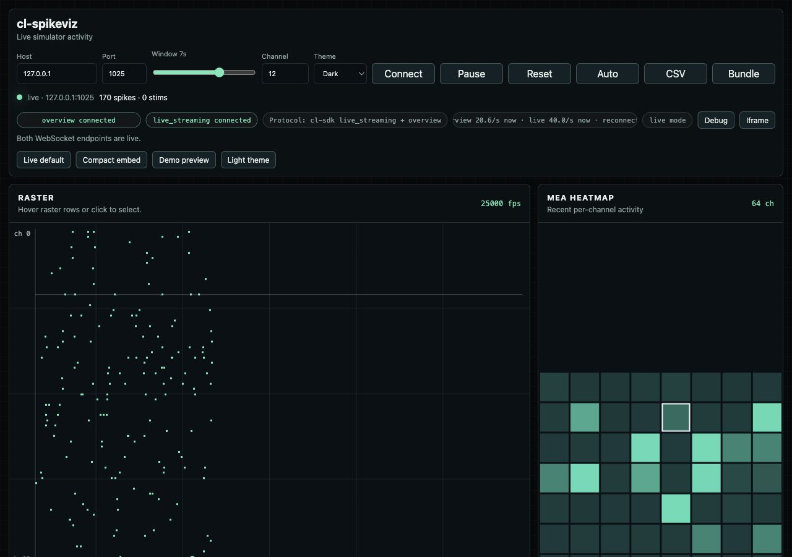
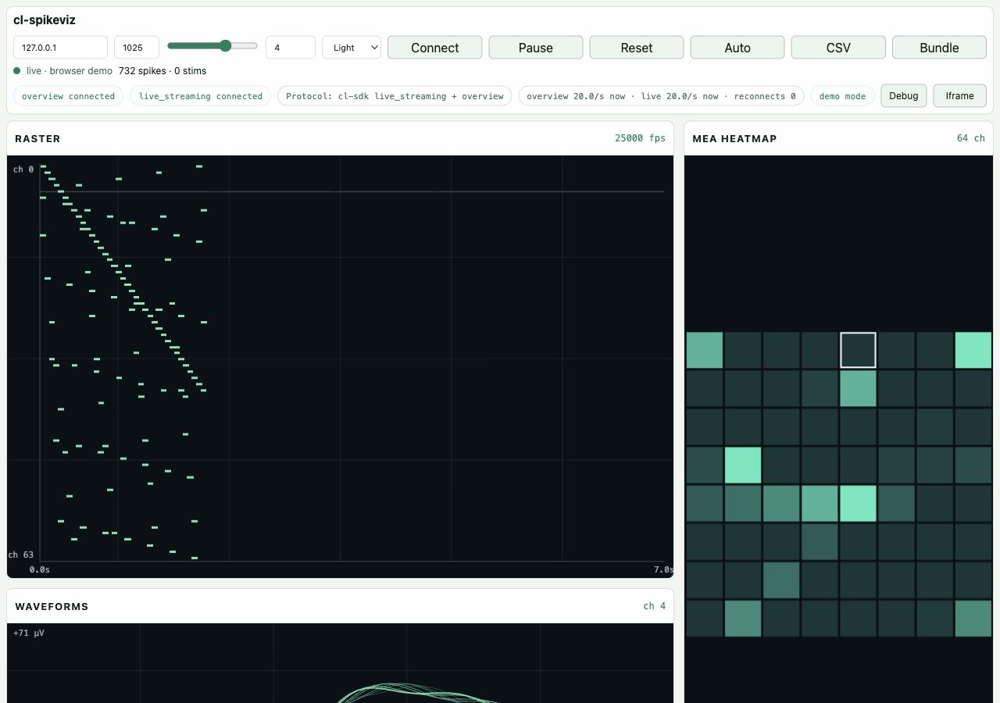
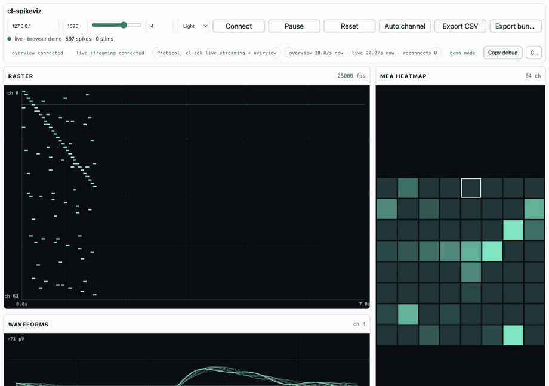

# cl-spikeviz

Standalone live visualiser for the `cl-sdk` simulator WebSocket stream.

It connects directly to the simulator's built-in WebSocket server and renders three synchronized 2D views:

- Raster: rolling spike and stim events by channel.
- MEA heatmap: recent per-channel activity from the overview stream.
- Waveforms: latest 75-sample spike waveforms for the selected channel.

The default 2D dashboard does not require a framework, build step, CDN, analytics, WebGL, or runtime dependency. An optional experimental 3D MEA view lazy-loads the pinned local Three.js module from `vendor/three.module.js` when `view=3d` or `view=split` is enabled.

## Preview







## Quickstart

Install the simulator in a Python 3.12+ environment:

```bash
python3 -m venv .venv
source .venv/bin/activate
pip install cl-sdk
```

Start the simulator WebSocket stream:

```bash
cd cl-spikeviz
python3 tools/run_simulator.py --seconds 300
```

Serve the visualiser:

```bash
python3 -m http.server 8080
```

Open:

```text
http://127.0.0.1:8080/?host=127.0.0.1&port=1025&window=5
```

The default WebSocket endpoints are:

- `ws://127.0.0.1:1025/_/ws/overview`
- `ws://127.0.0.1:1025/_/ws/live_streaming`

## Embed

```html
<iframe
  src="https://your-static-host.example/cl-spikeviz/?host=127.0.0.1&port=1025&window=7&channel=12&compact=1"
  width="100%"
  height="720"
  title="cl-spikeviz live activity">
</iframe>
```

The app also includes a `Copy iframe` button that copies a compact embed snippet for the current URL.

Query parameters:

- `host`: WebSocket host, default `127.0.0.1`.
- `port`: WebSocket port, default `1025`.
- `window`: raster window in seconds, from `1` to `10`, default `5`.
- `view=3d`: show the experimental 3D microelectrode array view.
- `view=split`: show the raster/waveform dashboard alongside the experimental 3D array.
- `compact=1`: denser layout for smaller iframe embeds.
- `demo=1`: browser-only generated activity, useful for previews when the simulator is not running.
- `channel=12`: preselect a channel for waveform inspection.
- `theme=dark`: default dark theme. Use `theme=light` for the light theme.

## Experimental 3D MEA View

The 3D track is optional and leaves the 2D MVP as the default. Open it with the segmented control in the top bar or with:

```text
http://127.0.0.1:8080/?demo=1&view=3d
http://127.0.0.1:8080/?host=127.0.0.1&port=1025&view=split
```

The view renders a 64-electrode 8x8 array using Three.js. Incoming overview activity drives electrode height and green/cyan intensity, stim flags render amber, spike and stim events create short-lived rings above the active electrode, and the selected channel is marked with a white ring. Hovering or clicking an electrode updates the same selected/hovered channel state used by the raster, heatmap, and waveform views. Pause freezes incoming state and the visible pulse animation.

Three.js is vendored locally so the visualiser remains static-host friendly and does not depend on a CDN at runtime. To update it intentionally, replace `vendor/three.module.js` with a pinned upstream `three.module.js` build and run `npm run test:ui`.

## Diagnostics

The top bar reports the two simulator endpoints separately:

- `overview`: heatmap metadata and min/max/flag chunks.
- `live_streaming`: `cl_spikes` and `cl_stims` events.
- `Protocol: cl-sdk live_streaming + overview`: visible protocol marker for screenshots and debug captures.

Use `Copy debug` to copy the current URL, mode, endpoint states, fps, channel count, selected channel, and event totals. `Copy iframe` copies a compact embed snippet for the current URL. `Reset` clears the current rolling buffers without reconnecting.

Useful controls:

- `Channel`: select a specific channel by number.
- `Auto channel`: keeps the waveform panel following the currently active channel.
- Raster and heatmap hover readouts show channel activity, spike count, and last spike time.
- `Export CSV`: downloads the current rolling spike/stim window as `time_s,channel,type`.
- `Export bundle`: downloads debug JSON with connection state, health metrics, totals, selected channel, and recent events.
- Presets: `Live default`, `Compact embed`, `Demo preview`, and `Light theme`.
- Keyboard shortcuts: `Space` pause/resume, `R` reset, `A` auto channel, `ArrowUp/ArrowDown` selected channel.

Browser-only preview:

```text
http://127.0.0.1:8080/?demo=1&compact=1&window=7&theme=light
```

## Protocol Notes

This implementation was checked against `Cortical-Labs/cl-sdk` source:

- `src/cl/visualisation/_websocket_subprocess.py`
- `src/cl/visualisation/web/engine.mjs`
- `README.md` and `docs/index.md` WebSocket documentation

The client subscribes to `cl_spikes` and `cl_stims` on `/_/ws/live_streaming`. Spike payloads are decoded as:

```text
timestamps: N * uint64 little-endian
channels:   N * uint8
padding:    align next section to 8 bytes
samples:    N * 75 * float32 little-endian
```

Waveform samples are already converted to microvolts by `cl-sdk` before broadcast, so the browser does not rescale them.

## Testing

Install dev test dependencies once:

```bash
npm install
```

Run all tests:

```bash
npm test
```

Run parser-only tests:

```bash
npm run test:parse
```

Run browser smoke tests for the default 2D dashboard, 3D demo view, compact split view, and 3D channel selection:

```bash
npm run test:ui
```

If Playwright reports that Chromium is missing, install the browser once:

```bash
npx playwright install chromium
```

Demo mode requires only the static server and browser. Live mode additionally requires `cl-sdk` in the active Python environment.

Capture live protocol fixtures while `tools/run_simulator.py` is running:

```bash
pip install websockets
python tools/capture_protocol.py --seconds 5 --out test/fixtures
```

The capture tool writes JSON headers plus binary payloads for manual self-review and future fixture-based tests.

## Troubleshooting

| Symptom | What to check |
| --- | --- |
| `ModuleNotFoundError: No module named 'cl'` | Activate the Python environment used for the simulator and run `pip install cl-sdk`. |
| `Simulator not running` | Start `python3 tools/run_simulator.py` and confirm port `1025` is free. |
| `overview connected; live_streaming missing` | The simulator is reachable, but `/_/ws/live_streaming` is reconnecting. Check the simulator process and browser console. |
| `live_streaming connected; overview missing` | Events may arrive, but heatmap metadata is missing. Check `/_/ws/overview`. |
| `live_streaming connected but no spikes yet` | Wait a few seconds, verify `cl_spikes` subscription, or try `?demo=1` to confirm the UI path. |
| `Protocol mismatch` | Run `python3 tools/capture_protocol.py --seconds 5 --out test/fixtures` and compare fixture parsing with `npm test`. |
| UI is too dense in an iframe | Add `compact=1` or use the `Copy iframe` button. |

## License

MIT
